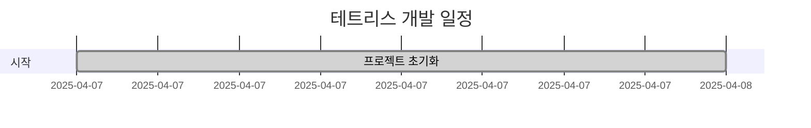

# 🎮 Tetris-cpp

C++로 만드는 콘솔 테트리스 프로젝트

## 🛠️ 기술 스택

## 🤖 사용 AI

---

## 📐 설계 문서

| 문서 | 설명 |
|------|------|
| [📊 플로우차트 (draw.io로 열기)](https://app.diagrams.net/?url=https://raw.githubusercontent.com/Chance031/Tetris-cpp/main/Tetris.drawio) | 게임 전체 상태 흐름, 플레이 루프, 입력 처리, 충돌 판정, 정산 시퀀스, UML (6페이지) |

---

## 📅 개발 일지

<!-- GANTT_START -->

<!-- GANTT_END -->

---

## ✅ 구현 현황

<!-- CHECKLIST_START -->
- [ ] 맵 렌더링
- [ ] 블록 생성 및 렌더링
- [ ] 블록 이동 / 회전
- [ ] 충돌 처리
- [ ] 라인 클리어
- [ ] 점수 시스템
- [ ] 게임 오버 / 재시작
<!-- CHECKLIST_END -->

---

## 📝 작업 로그

<!-- LOG_START -->
| 날짜 | 섹션 | 작업 내용 |
|------|------|-----------|
| 2025-04-07 | 시작 | 프로젝트 초기화 |
<!-- LOG_END -->
