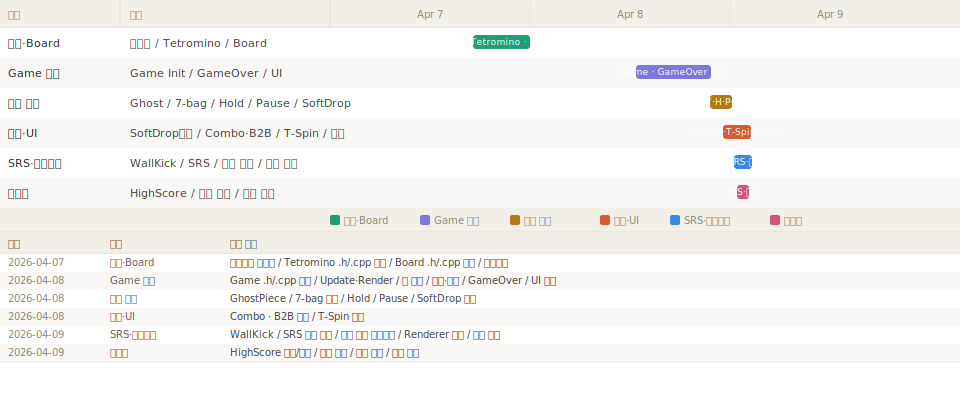

# Tetris-cpp

C++로 만드는 콘솔 테트리스 프로젝트

## 기술 스택

## 사용 AI

---

## 설계 문서

| 문서 | 설명 |
|--------|--------|
| [플로우차트 (draw.io로 열기)](https://app.diagrams.net/?url=https://raw.githubusercontent.com/Chance031/Tetris-cpp/main/Tetris.drawio) | 게임 전체 상태 흐름, 플레이 루프, 입력 처리, 충돌 판정, 정산 시퀀스, UML (6페이지) |

---

## 개발 일지

---

## 플레이 가이드

### 환경

- Windows (콘솔 앱)
- ANSI 색상 지원 터미널 권장 (Windows Terminal 등)

### 빌드

Visual Studio에서 `Tetris.sln` 열고 빌드 후 실행.

### 조작 키

| 키 | 동작 |
|---|---|
| `←` `→` | 블록 좌우 이동 |
| `↓` | 소프트 드롭 (1점/칸) |
| `Space` | 하드 드롭 (2점/칸) |
| `Z` | 시계 방향 회전 |
| `X` | 반시계 방향 회전 |
| `C` | 홀드 |
| `P` | 일시정지 / 재개 |
| `R` | 재시작 (게임오버 후) |
| `Q` / `Esc` | 종료 |

### 점수 체계

| 액션 | 점수 |
|---|---|
| Single | 100 × 레벨 |
| Double | 300 × 레벨 |
| Triple | 500 × 레벨 |
| Tetris | 800 × 레벨 |
| T-Spin Single | 800 × 레벨 |
| T-Spin Double | 1200 × 레벨 |
| T-Spin Triple | 1600 × 레벨 |
| Back-to-Back 보너스 | 위 점수의 +50% |
| 콤보 보너스 | 50 × 콤보 수 × 레벨 |
